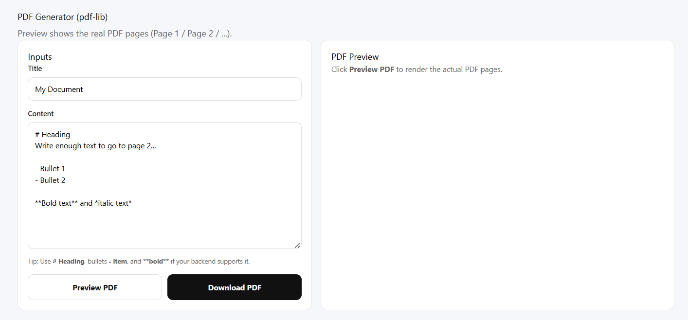
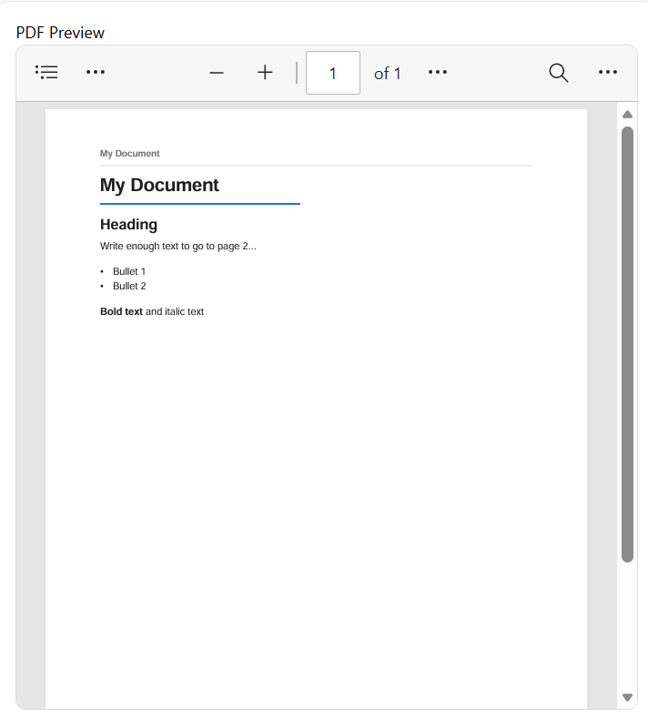

# PDF Generation Service

> A stateless PDF generation microservice with live preview capabilities

[](https://nodejs.org/)
[](https://expressjs.com/)
[](https://reactjs.org/)
[](LICENSE)

## Overview

A lightweight PDF generation microservice built with Node.js, Express, and pdf-lib. Generate PDFs from markdown-style content through a simple REST API, with a React-based preview interface.

### Why This Service?

- **Decouples PDF logic** from your main application
- **Lightweight solution** using pdf-lib (no browser dependencies like Puppeteer)
- **Stateless architecture** - no database or file storage needed
- **Easy to use** - simple REST API that works with any tech stack

## Features

- RESTful API for PDF generation
- Multi-page support with automatic page breaks
- Headers and footers with dates and page numbers
- Markdown-style formatting (headings, lists, paragraphs)
- Live preview interface
- Clean MVC architecture

> **Note:** This service supports basic markdown-style formatting including headings (`#`, `##`), bullet lists (`-`), and paragraphs. Perfect for reports, documentation, and simple formatted PDFs.

## Technology Stack

**Backend:**
- Node.js + Express.js
- pdf-lib for PDF generation
- CORS middleware

**Frontend:**
- React 18 + Vite
- Fetch API for downloads
- Responsive CSS

## Project Structure

```
pdf-service/
│
├── backend/
│   ├── controllers/          # Request handlers
│   ├── routes/              # API endpoints
│   ├── services/            # PDF generation logic
│   ├── utils/               # Helper functions
│   ├── config/              # Configuration
│   └── index.js             # Entry point
│
├── frontend/
│   ├── src/
│   │   ├── App.jsx          # Main component
│   │   └── main.jsx         # Entry point
│   └── vite.config.js
│
└── screenshots/             # Application screenshots
    ├── PDFGenerator.png
    ├── Preview.png
    └── Downloaded pdf.png
```

## Quick Start

### Prerequisites

- Node.js 16.x or higher
- npm 7+

### Installation

**1. Clone the repository**

```bash
git clone <your-repository-url>
cd pdf-generation-service
```

**2. Backend Setup**

```bash
cd backend
npm install
npm start
```

Backend runs at `http://localhost:5002`

**3. Frontend Setup**

Open a new terminal:

```bash
cd frontend
npm install
npm run dev
```

Frontend runs at `http://localhost:5173`

**4. Test the Application**

1. Open `http://localhost:5173` in your browser
2. Enter a title and content (try the example below)
3. Click "Preview" to see page layout
4. Click "Download PDF" to generate and download

**Quick Test Example:**
```
Title: My First PDF
Content: # Welcome\n- This is item 1\n- This is item 2\n\n## Summary\nPDF generated successfully!
```

## Screenshots

### PDF Generator Interface


*Clean, intuitive interface for creating PDFs with title and content input*

### Live Preview


*Real-time page-by-page preview showing how your content will flow in the final PDF*

### Downloaded PDF


*Professional, multi-page PDF output with headers, footers, and formatted content*

## API Documentation

### Generate PDF

**Endpoint**

```http
POST http://localhost:5002/pdf/generate
```

**Request Body**

```json
{
  "title": "Monthly Report",
  "content": "# Executive Summary\n- Q1 Revenue: ₹2.5M\n- Growth Rate: 25%\n\n## Key Achievements\nSuccessfully launched new product line."
}
```

| Field | Type | Required | Description |
|-------|------|----------|-------------|
| `title` | string | Yes | Document title (appears in header) |
| `content` | string | Yes | Markdown-formatted content |

**Response**

Returns PDF file with proper headers for download.

**Example using cURL**

```bash
curl -X POST http://localhost:5002/pdf/generate \
  -H "Content-Type: application/json" \
  -d '{
    "title": "Report",
    "content": "# Report Details\n- Category: Sales\n- Amount: ₹2500"
  }' \
  --output report.pdf
```

**Example using JavaScript**

```javascript
const response = await fetch('http://localhost:5002/pdf/generate', {
  method: 'POST',
  headers: {
    'Content-Type': 'application/json',
  },
  body: JSON.stringify({
    title: 'Monthly Report',
    content: '# Summary\n- Revenue increased\n- Costs decreased'
  })
});

const blob = await response.blob();
const url = window.URL.createObjectURL(blob);
const a = document.createElement('a');
a.href = url;
a.download = 'report.pdf';
a.click();
```

## Content Formatting

The service supports markdown-inspired syntax:

### Headings

```markdown
# Primary Heading (H1)
## Secondary Heading (H2)
```

### Lists

```markdown
- First item
- Second item
- Third item
```

### Paragraphs

```markdown
Regular paragraph text with automatic line wrapping.

Multiple paragraphs are separated by blank lines.
```

### Complete Example

```json
{
  "title": "Project Status Report",
  "content": "# Project Overview\n\n- Project: PDF Microservice\n- Status: Completed\n- Timeline: 2 weeks\n\n## Deliverables\n\n- REST API for PDF generation\n- React-based preview interface\n- Complete documentation\n\n## Next Steps\n\nDeploy and monitor performance."
}
```

## Architecture

### Stateless Design

```
Request → Process → Response
```

- No database needed
- No file storage
- Each request is independent
- Easy to scale horizontally

### Clean Code Structure

```
Routes → Controllers → Services → Utils
```

Each layer has a clear responsibility, making the code easy to test and maintain.

## Configuration

### Environment Variables

Create `.env` in backend directory:

```env
PORT=5002
NODE_ENV=development
CORS_ORIGIN=http://localhost:5173
```

### Optional Enhancements

#### Input Validation

For production use, consider adding validation:

```bash
npm install express-validator
```

```javascript
const { body, validationResult } = require('express-validator');

app.post('/pdf/generate', [
  body('title').isString().isLength({ min: 1, max: 200 }),
  body('content').isString().isLength({ min: 1, max: 50000 })
], (req, res) => {
  const errors = validationResult(req);
  if (!errors.isEmpty()) {
    return res.status(400).json({ errors: errors.array() });
  }
  // Process request
});
```

#### Payload Limits

```javascript
app.use(express.json({ limit: '1mb' }));
```

#### Rate Limiting

```bash
npm install express-rate-limit
```

```javascript
const rateLimit = require('express-rate-limit');

const limiter = rateLimit({
  windowMs: 15 * 60 * 1000, // 15 minutes
  max: 100 // limit each IP to 100 requests per window
});

app.use('/pdf/', limiter);
```

## Troubleshooting

### PDF Won't Open After Download

Make sure backend sets proper headers:

```javascript
res.setHeader('Content-Type', 'application/pdf');
res.setHeader('Content-Disposition', 'attachment; filename="document.pdf"');
```

Frontend must handle binary data correctly:

```javascript
const blob = await response.blob();  // Not .json()
```

### CORS Errors

Configure CORS properly in backend:

```javascript
const cors = require('cors');

app.use(cors({
  origin: process.env.CORS_ORIGIN || 'http://localhost:5173',
  credentials: true
}));
```

### Multi-Page Issues

Ensure page break logic is implemented in `pdfService.js`:
- Check bottom margin calculation
- Reserve footer space before page breaks
- Verify new page creation when content exceeds threshold

## Docker Deployment (Optional)

> **Note:** Docker deployment is optional. The service works perfectly fine running directly with Node.js as shown in Quick Start.

**Backend Dockerfile:**

```dockerfile
FROM node:16-alpine
WORKDIR /app
COPY package*.json ./
RUN npm ci --only=production
COPY . .
EXPOSE 5002
CMD ["node", "index.js"]
```

**docker-compose.yml:**

```yaml
version: '3.8'
services:
  backend:
    build: ./backend
    ports:
      - "5002:5002"
    environment:
      - NODE_ENV=production
    restart: unless-stopped
  
  frontend:
    build: ./frontend
    ports:
      - "80:80"
    depends_on:
      - backend
    restart: unless-stopped
```

Deploy:

```bash
docker-compose up -d
```

## Future Enhancements

**Formatting & Styling:**
- Bold, italic, and underline text support
- Custom fonts and color options
- Table generation for structured data

**Media & Templates:**
- Image embedding (logos, signatures)
- Pre-built PDF templates (invoice, report, certificate)

**Integration & Storage:**
- Cloud storage integration (AWS S3, Google Drive)
- Async generation with queue system (BullMQ/Redis)

**Advanced Features:**
- Digital signatures and encryption
- PDF merging and splitting
- Watermark support

## Contributing

Contributions are welcome! Please follow these steps:

1. Fork the repository
2. Create a feature branch (`git checkout -b feature/amazing-feature`)
3. Commit your changes (`git commit -m 'Add amazing feature'`)
4. Push to the branch (`git push origin feature/amazing-feature`)
5. Open a Pull Request

## License

This project is licensed under the MIT License - see the [LICENSE](LICENSE) file for details.

## Author

**Naina Kothari**  
GitHub: [@NainaKothari-14](https://github.com/NainaKothari-14)

---

Built with [pdf-lib](https://pdf-lib.js.org/) | Inspired by modern microservice architecture
